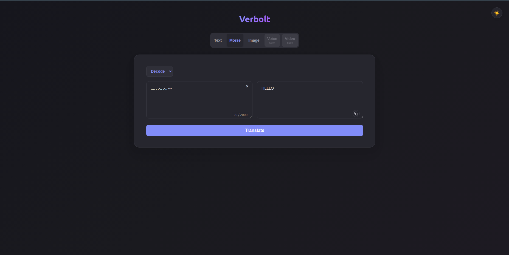
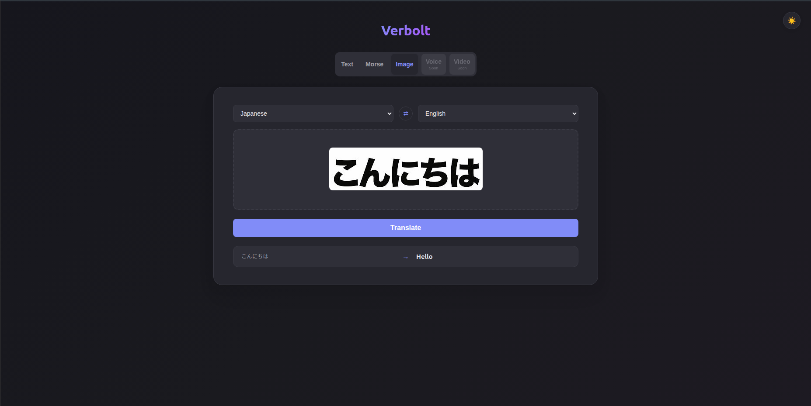

# Verbolt

A full-stack translation web app supporting text, Morse code, and image (OCR) translation.

## Features

- Translate text across 100+ languages
- Encode/decode Morse code
- Upload an image to detect and translate text within it
- Light/dark mode

## Roadmap

- Voice translation
- Video translation
- Overlaying translated text directly onto uploaded images
- Support for Sign language

## Showcase

### Text Translation


### Morse code translation



### Image translation



## Tech Stack

**Frontend:** React, TypeScript, Vite, Axios
**Backend:** Python, FastAPI, deep-translator, EasyOCR

## Getting Started

### Backend

```bash
cd backend
python -m venv venv
source venv/bin/activate   # Windows: venv\Scripts\activate
pip install -r requirements.txt
uvicorn main:app --reload
```

### Frontend

```bash
cd frontend
npm install
npm run dev
```

Both servers need to be running for the app to work.
