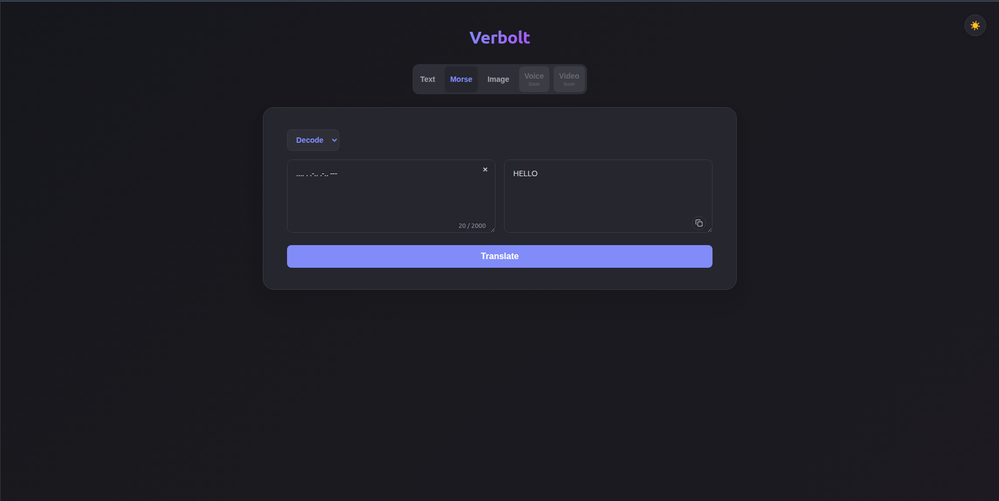
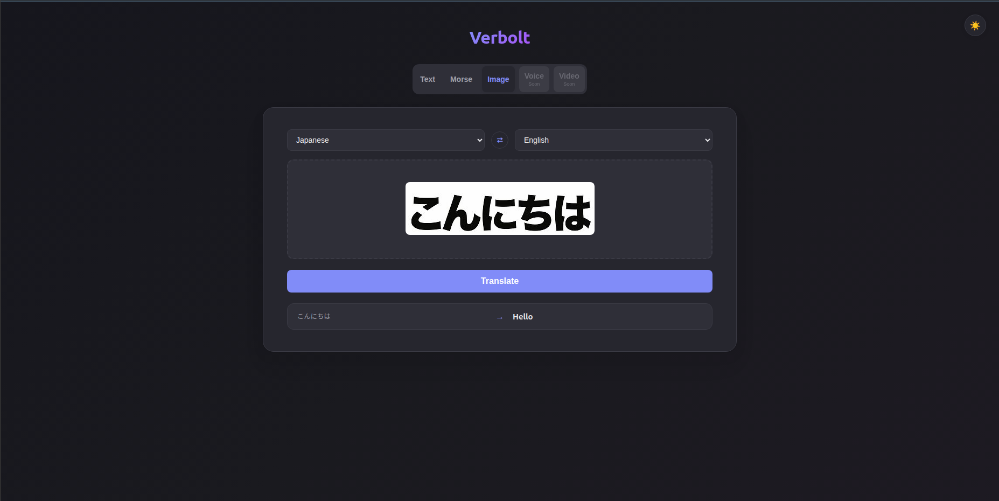

# Verbolt

A full-stack translation web app supporting text, Morse code, and image (OCR) translation.

## Features

- Translate text across 100+ languages
- Encode/decode Morse code
- Upload an image to detect and translate text within it
- Light/dark mode

## Roadmap

- Voice translation
- Video translation
- Overlaying translated text directly onto uploaded images
- Support for Sign language

## Showcase

### Text Translation


### Morse code translation



### Image translation



## Tech Stack

**Frontend:** React, TypeScript, Vite, Axios
**Backend:** Python, FastAPI, LibreTranslate, EasyOCR

## Getting Started

### Translation server

Verbolt translates with a self-hosted [LibreTranslate](https://github.com/LibreTranslate/LibreTranslate) server. Install it in its own virtualenv so its dependencies don't clash with EasyOCR's:

```bash
python -m venv ~/.venvs/libretranslate
~/.venvs/libretranslate/bin/pip install libretranslate
~/.venvs/libretranslate/bin/libretranslate --load-only en,es,fr,de,it,pt,ja,ko,zh-Hans --port 5000
```

The first start downloads the language models (about 2 GB), which takes a few minutes. Drop `--load-only` to get every language LibreTranslate supports.

The backend expects the server at `http://localhost:5000`. Set `LIBRETRANSLATE_URL` (and `LIBRETRANSLATE_API_KEY` if your server requires one) to point it somewhere else.

### Backend

```bash
cd backend
python -m venv venv
source venv/bin/activate   # Windows: venv\Scripts\activate
pip install -r requirements.txt
uvicorn main:app --reload
```

### Frontend

```bash
cd frontend
npm install
npm run dev
```

Both servers need to be running for the app to work.
