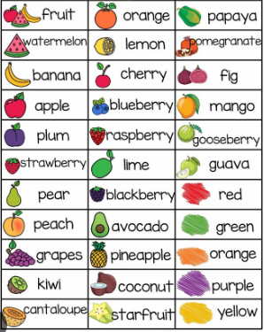
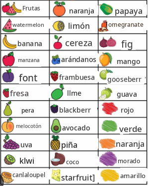

# Verbolt

A full-stack translation web app for text, Morse code, and images. Upload a photo or screenshot and Verbolt reads the text in it, translates it, and redraws the image with the translation in place. Translation runs on a self-hosted LibreTranslate server, so there are no API keys or rate limits.

## Features

- Translate text between any languages your LibreTranslate server has installed, with auto-detect
- Encode/decode Morse code
- Translate images: text is detected with OCR (English, Spanish, French, German, Italian, Portuguese, Japanese, Chinese, Korean), then redrawn in the target language in the original position and color
- Switch between the translated and original image, and download the result
- Light/dark mode

## Roadmap

- Voice translation
- Video translation
- Support for Sign language

## Showcase

### Text Translation


### Morse code translation


### Image translation

English to Spanish:

| Original | Translated |
| --- | --- |
|  |  |

## Tech Stack

**Frontend:** React, TypeScript, Vite, Axios
**Backend:** Python, FastAPI, LibreTranslate, EasyOCR, OpenCV, Pillow

## Getting Started

### Translation server

Verbolt translates with a self-hosted [LibreTranslate](https://github.com/LibreTranslate/LibreTranslate) server. Install it in its own virtualenv so its dependencies don't clash with EasyOCR's:

```bash
python -m venv ~/.venvs/libretranslate
~/.venvs/libretranslate/bin/pip install libretranslate
~/.venvs/libretranslate/bin/libretranslate --load-only en,es,fr,de,it,pt,ja,ko,zh-Hans --port 5000
```

The first start downloads the language models (about 2 GB), which takes a few minutes. Drop `--load-only` to get every language LibreTranslate supports.

The backend expects the server at `http://localhost:5000`. Set `LIBRETRANSLATE_URL` (and `LIBRETRANSLATE_API_KEY` if your server requires one) to point it somewhere else.

### Backend

```bash
cd backend
python -m venv venv
source venv/bin/activate   # Windows: venv\Scripts\activate
pip install -r requirements.txt
uvicorn main:app --reload
```

### Frontend

```bash
cd frontend
npm install
npm run dev
```

Both servers need to be running for the app to work.
